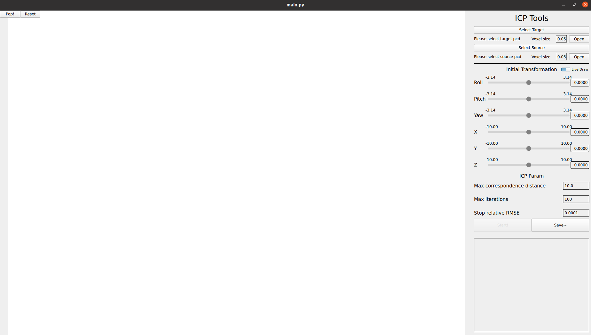

# ICP GUI Tool
## Installation
Python Version: `3.9.20`
```
pip3 install -r requirements.txt
```
## Usage
```
python3 main.py
```

- `Pop!`:A pop-up window to adjust view point. (Note: this will block all process, please close the it after adjustment.)
- `Reset`: Reset the view point.
- `Select Target/Source`: Choose the path leading to the PCD file.
- `Voxel size`: Voxel size for downsampling
- `Open`: Open the PCD file. A downsample process will be automatically engaged. 
- `Live Draw`: Whether to show the point cloud in live. Suggested to switch off if the point cloud is large.
- `Roll/Pitch/Yaw/X/Y/Z` Panel: Adjust the initial guess for better ICP result. Low/high bond of adjustment can be changed.
- `ICP Param`: Parameters used in ICP alignment.
- `Start/stop!`: Start/stop the ICP alignment.
- `Save *`: Save the transformation result or merged PCD file.
